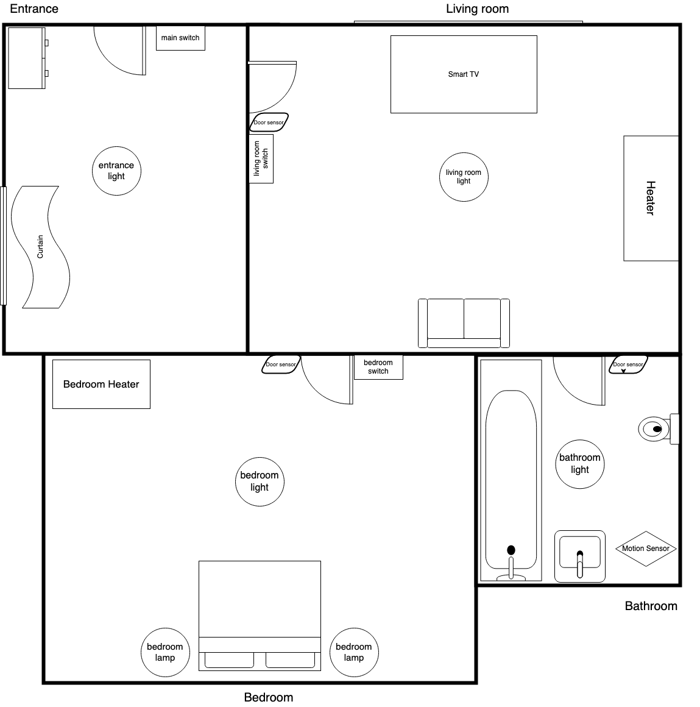

## Check-in 1 (Week 2)

IoT device management:
- High-level purpose: The DSL can be used by people to help plan their smart home device automations and integrations. It will generate a simulation of the smart home, in which the user can trigger events and see their automations occur in action.
- Rich features:
  1. Define types of devices, complete with a set of states a device of the defined type can have, as well as its initial state. Type hierarchy is possible.
  2. Build a mockup of the smart home. The user can define a room containing a set of devices which are of a certain type.
  3. Define actions that will be triggered upon the change of the specified device’s state. The action can contain if-conditions and loops.
- Example (updated after first user study):
  ```
  type Light {
      enum power [ON, OFF]
      string color 
  }
  
  type SmallLight inherits Light {
      enum power [DIMMED]
  }
  
  type Switch {
      enum state [ON, OFF]
  }
  
  type Heater {
      enum power [ON, OFF]
      number level [0, 10]
  }
  
  
  room bedroom {
      bedroom_light of Light(OFF, "ffffff")
      bedroom_lamp of SmallLight(OFF, "ffebd9")
      bedroom_heater of Heater(OFF, 3)
      bedroom_switch of Switch(OFF)
  }
  
  room living_room {
      main_light of Light(OFF, "ffffff")
      main_switch of Switch(OFF)
      main_heater of Heater(OFF, 3)
  }

  
  action bedroom_all on bedroom_switch.state {
      if bedroom_switch.state is ON {
          set bedroom_light.power to ON
          set bedroom_lamp.power to DIMMED
          set bedroom_heater.power to ON
      }
  }
  
  action lights_all on main_switch.power {
      if main_switch.power is OFF {
          set main_light.power to OFF
          for light of Light in bedroom {
              set light.power to OFF
          }
      }
  }
  
  action sync_heaters on [main_heater.level, bedroom_heater.level] {
      set bedroom_heater.level to main_heater.level
  }
  ```
  
---

## Check-in 2 (Week 3)

### Jan 21 - 27
Jan 26 - Check-in 2 
- All:
  - Assign responsibilities for everyone.
  - Create a complete example of the DSL, with all finalized language features.
  - (Above are complete - progress so far.)
### Jan 28 - Feb 3
Feb 2 - Check-in 3
- All: 
  - Define grammar rules of the DSL.
  - Define the structure of the AST.
  - Plan and finish the first user study.
- Get started on the implementation.
  - Parser: String containing DSL --> AST
    - Richard
    - Jeffery
  - Evaluator: AST --> working console application
    - Ning
    - Terry
    - Leo
- Tests for components will be written by whoever wrote the component itself, as they will be the most familiar with
  what the tests should be about.
- With an agreed-upon definition of the AST, tests for the parser and evaluator components can be written independently
  and the implementation can be done in parallel.
- Invariants:
  - Initial states for all properties must be defined for a device upon initialization, including inherited properties.
  - Subtypes must not be able to change definitions of inherited attributes. For enum attributes, a redefinition may be
    done to specify additional states.
  - Cannot refer to devices/rooms/types that hasn't been instantiated.
### Feb 4 - Feb 10
Feb 9 - Check-in 4
- All: Plan for the second user study.
- Finish bulk of the implementation. Revise language design/tests/implementation based on results of the first user study.
### Feb 11 - Feb 17
Feb 16 - Check-in 5
- All: Make a draft for the video.
- Possibly make final changes to language design/tests/implementation based on the second user study.
### Feb 18 - Feb 24
- All: Make the demo video.
### Feb 25 - Feb 26
Feb 26 - Due date

---

## Check-in 3 (Week 4)

To improve upon our original design and introduce some complexity/dynamicity, we added string and number types for 
device properties, which can hold any value of the specified type. The user is also able to set the value of a property 
equal to the value of another property (from the same or different device), without directly specifying the literal 
value.

We explained the syntax of our language using the following template:

```
type <type_name> {
    enum <enum_name> [state0, state1]
    string <string_name>
    number <number_name> [0, 10]
    …
}

type <subtype_name> inherits <type_name> {
    enum <enum_name> [state2]
    string <diff_string_name>
}

room <room_name> {
    device device_name of <type_name>(state0, “string”, 0)
    …
}

action <action_name> on <device_name> {
    set <device__name>.<property_name> to <value>

    if <device__name>.<property_name> is <state> {
        …	
    }

    for <variable_name> of <type> in <room_name> {
        …
    }
    …
}
```

We also clarified some additional invariants and conditions:
- Initial states for all properties must be defined for a device upon initialization, including inherited properties.
- You cannot refer to devices/rooms/types that haven't been instantiated.
- Subtypes can’t change the definition of properties inherited from its supertype, but for enum properties more states 
  may be added.
- Enum properties must specify at least 1 state, and number properties must specify a range: a minimum and a maximum 
  value. String properties will not have anything additional other than the name declaration; initial values are 
  specified per-device.
- Devices can only be declared within a room declaration.
- If-conditions and for loops can only appear within an action.

We presented a diagram of our example home and the automations we wanted, and asked them to write the necessary 
definitions using our language to make the automations happen.



Devices:
- Light: On or off, off by default.
- Lamp: On, off, or dimmed. A type of light.
- TV: On or off. Can also be muted or unmuted.
- Heater: On or off, with an adjustable heat level 0 to 10. On by default.
- Switch: On or off. Off by default.
- Door sensor: On when you're in the room, off otherwise.

All:
- When the heat level of any of the heaters is changed, we want the heat level of all other heaters to change accordingly (so that they all have the same heat level).

Entrance:
- When we walk into the entrance, we want the main lights of all rooms to turn on. The main switch should be turned on also.
- When the main switch is off, it should turn off all main lights.

Living Room:
- When we walk into the living room, the living room light and the smart TV should automatically turn on.
- The living room switch should only control the living room main light.

Bedroom:
- When we walk into the bedroom, the bedroom light should automatically turn on.
- When the bedroom switch is off, it should turn off the bedroom main light.
- When the bedroom main light is turned on, the bedroom lamps should turn off. When the bedroom main light is turned off, the lamps should turn on.
- When the lamps are dimmed, the living room TV should be muted and the color of the lamps should change to a warmer white color.

Bathroom:
- When we walk into the bathroom, the bathroom light should automatically turn on. When we exit the bathroom, the bathroom light should turn off.

### Some notes from the study:
- The user noted that the language syntax is generally straightforward and easy to think about. However, certain parts of the grammar recieved comments:
   - for someone with less programming experience, the idea that type declaration is only for the interface, and the instantiation happens inside of the room decls may be difficult conceptually
   - prefacing every declaration inside the room with "device" is unnecessary, as nothing else can be declared in that location anyways
   - it was unclear if it was possible to override variables when working with the inheritance
-  The user found that it was very tedious to declare all the rooms, especially when rooms would share a lot of the same devices (ie. door sensor and lights).
- Translating the instructions for the automations to the DSL code was relatively easy.
- While writing the actions, it was initally unclear how the actions would trigger. The user then said that it seemed weird that any state change of the device specified in the action declaration can trigger the action. They stated that maybe change of only the relevant property should trigger the action.
- To implement the heater level sync, the user needed to declare two actions that are almost identical, just conditioned on the state change of the two different heaters. The user noted that maybe an action should be able to condition on multiple devices.
- It could also be helpful to include functionality in the actions to allow the user to see how a value has changed. (ie. value increased, value decreased etc.)

Reflecting the feedback from the user, we are looking at ways to create maybe a room "template", for cases where many rooms share the same set of devices. We are also considering making the action declaration more comprehensive, specifying only the relevant property of the device and allowing the action to condition on multiple devices. In the case of multiple devices, we would need a way for the user to know which device was the one being triggered. Certain parts of the grammar could also be simplified, making the declaration process less tedious, such as device instantiation. This would likely look something like the following.

*Current implementation:*
```
room Bedroom {
    device bedHeater of Heater(ON, 5)
    device bedLight of Light(OFF)
    device lamp1 of Light(OFF)
    device lamp2 of Light(OFF)
    device doorSensorBed of DoorSensor(OFF)
    device bedSwitch of Switch(OFF) 
}
```
*After changes:*
```
room Bedroom {
    bedHeater of Heater(ON, 5)
    bedLight of Light(OFF)
    lamp1 of Light(OFF)
    lamp2 of Light(OFF)
    doorSensorBed of DoorSensor(OFF)
    bedSwitch of Switch(OFF) 
}
```

These changes are all not that intrusive, and should not affect the current planned timeline.

Some tests that we can potentially write after the lexer and parser has been set up would be tests that reflect our language’s invariants/constraints, as specified above. Violations of the invariants should raise an error.

---

## Check-in 4 (Week 5)

- Status of implementation.
  - So far, we have completed the ANTLR lexer and parser rules and the initial implementation for our AST nodes. We have
    now begun working on the parser and the evaluator implementations in parallel.
  - The evaluator so far has a basic implementation utilizing the visitor pattern, where the final output just prints
    all the declarations that has been made, and corresponding tests. We'll need to flesh out the details that produce
    the actual output that we expect for our final product, and write tests for it.
- Plans for final user study.
  - Current plans are to repeat the first user study, with the addition of a working parser and evaluator that will
    generate a console application.
  - The user study will be able to tell us if the error checking and the final output makes sense to the user.
- Planned timeline for the remaining days.
  - Before the final user study, we will finish all unit tests and implementations, and then together write some end-to-end
    tests that will see if the parser and evaluator work fine together and produce the expected output.
  - After the user study, we will take the feedback and make final adjustments to our implementation, if any.

---
## Check-in 5 (Week 6)

### User Study:
For our user study, we repeated the study from Check-in 3 on a new user. They were asked to write the code to construct the rooms based on the same information and picture provided in the previous study. Because our implementation was not fully complete at this point, the user's code was manually converted into our AST the same way we declared them in our unit tests (see EvaluatorTest.Java). The user then tried out all of the UI functions that are implemented at this point.

#### User Feedback:
1. When the program starts, display all the devices that were added, as they found it difficult to remember the names of the devices they added.
2. When a device is selected, give some information on the current state and status of that device
   - eg. when device `TV` is selected, display that it its `electronic_power` state is currently set to `ON`
   - Maybe display it in a tree/file system format?
3. There could be more user feedback when something is done successfully
   - eg. Explicitly show that `electronic_power` was set to `OFF` 

The big takeaway from this second user study is increasing the amount of information shown to the user. The user couldn't remember device/device names off the top of their head, and had to constantly refer back to the code they wrote and the diagrams. We will look at adding more information.

### Video:
We are still mainly focusing on finishing the implementation, so the video hasn't been the main focus, but we have some ideas for the format of the presentation. We will meet during the break regarding this topic.

### Timeline:
The main features of the evaluator are mostly implemented, so we are focusing more on streamlining the UI and related functionality. Once the parser is complete, we will meet as a group during the break to integrate the two parts, and wrap up anything else that needs to be worked on.

---